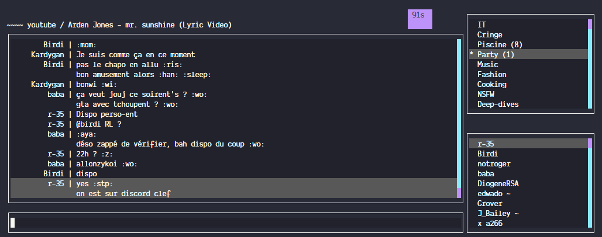

# SkyChatCLI

Command-line interface to connect to your favorite SkyChat instance



## Install

```bash
npm i -g skychat-cli
```

## Launch

Logging as `user` with password `password` on instance `some-skychat.com`

```bash
SKYCHAT_USER=user SKYCHAT_PASSWORD=password skychat-cli -h some-skychat.com
```

All options can be passed either through environment or CLI args

```bash
skychat-cli -h some-skychat.com -u user -p password
# or
SKYCHAT_HOST=skych.at SKYCHAT_USER=user SKYCHAT_PASSWORD=password skychat-cli
```

You can log in as guest by not specifying user/password

```bash
skychat-cli -h some-skychat.com
```
